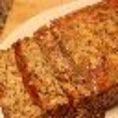
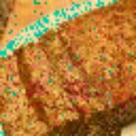
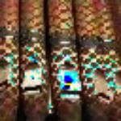
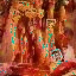

# Deep Steganography
This is the implementation of the paper **Hiding Images in Plain Sight:
Deep Steganography**.

[Paper Link](https://papers.nips.cc/paper/6802-hiding-images-in-plain-sight-deep-steganography)

Steganography is the practice of concealing a secret message within another,
ordinary, message. Commonly, steganography is used to unobtrusively hide a small message within the noisy regions of a larger image. Unlike many popular steganographic methods that encode the secret message within the least significant bits of the carrier image, this paper's  approach compresses and distributes the secret image’s representation across all of the available bits.

I have implementated this paper in keras.

## Implementation Details
### Dataset used
I used the **tiny-imagenet-200** dataset and further downsampled the images to size of (64,64,3) suing OpenCV. 

### Traing Details
I have trained the 2000 images randomly picked from the dataset. Half of them were used and trained as cover images and rest of them as messages. I have used **adam** optimizer. the model is trained for more than 890 epochs.

### Results

The results were quite good and the cover and contaiber image were almost same and message and reveal message image were also quite similar. 
Few example are given below.
Th below image are in this order

Carrier image----Message image---Container Image---Reveal message image

     

     

The images in the above results are taken from the test folder of dataset and the model is train on the images of of the train folder of the dataset. Also the images the images are expaned from a size of(64,64,3) to (150,150,3) in order to show a large image.

## Acknowledgment
The help was taken from the following github repository https://github.com/alexandremuzio/deep-steg. Thanks for sharing.
